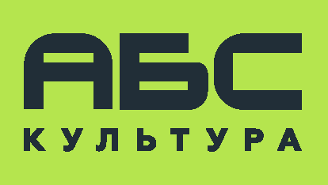

<html lang="ru">
<head>
  <meta charset="utf-8">
  <meta name="viewport" content="width=device-width,initial-scale=1">
  <title>АБС Культура - Промышленные теплицы и оборудование для садоводства</title>
  <link href="https://fonts.googleapis.com/css2?family=Commissioner:wght@300;400;500;600;700&display=swap" rel="stylesheet">
  
</head>
<body>
  <header>
    

      

        

          
        

        

          <h1>АБС Культура</h1>
          
Комплексные решения для сельского хозяйства

        

      

      <nav>
        <a href="#services">Услуги</a>
        <a href="#products">Оборудование</a>
        <a href="#projects">Проекты</a>
        <a href="#consulting">Консультации</a>
        <a href="#contacts">Контакты</a>
      </nav>
    

  </header>

  <main class="container">
    <section class="hero">
      <h2>Профессиональные решения для современного сельского хозяйства</h2>
      
Полный цикл услуг: от проектирования тепличных комплексов до агротехнического сопровождения и первых продаж вашей продукции.

      <a href="#contacts" class="btn">Получить консультацию</a>
    </section>

    <section id="services">
      <h2 style="font-size: 2rem; margin-bottom: 20px; color: var(--dark);">Наши услуги</h2>
      

        

          <h3>Продажа оборудования</h3>
          <ul class="service-list">
            <li>Промышленные теплицы</li>
            <li>Ягодные туннели</li>
            <li>Оборудование для теплиц</li>
            <li>Системы орошения и комплектующие</li>
            <li>Узлы автоматического внесения удобрений</li>
            <li>Автоматика и насосное оборудование</li>
            <li>Емкости и накопители для воды</li>
            <li>Оборудование для автоматического полива</li>
          </ul>
        

        

          <h3>Материалы и расходники</h3>
          <ul class="service-list">
            <li>Посадочный материал и саженцы</li>
            <li>Малообъемные грунты</li>
            <li>Материалы для шпалерных систем</li>
            <li>Комплектующие для систем орошения</li>
          </ul>
        

        

          <h3>Проекты и услуги</h3>
          <ul class="service-list">
            <li>Монтаж и шеф-монтаж</li>
            <li>Проекты под ключ (с 0 до первых продаж)</li>
            <li>Агротехническое сопровождение</li>
            <li>Консультационные услуги</li>
            <li>Составление бизнес-моделей</li>
            <li>Подбор техники и оборудования</li>
            <li>Руководство по реализации проекта</li>
          </ul>
        

      

    </section>

    <section id="products" style="margin-top: 60px;">
      <h2 style="font-size: 2rem; margin-bottom: 20px; color: var(--dark);">Ключевые направления</h2>
      

        

          
🏭

          <h3>Тепличные комплексы</h3>
          
Проектирование и строительство промышленных теплиц любой сложности под ключ

        

        

          
💧

          <h3>Системы орошения</h3>
          
Комплексные решения полива и автоматического внесения удобрений

        

        

          
🌱

          <h3>Агросопровождение</h3>
          
Полный цикл агротехнической поддержки от посадки до сбора урожая

        

        

          
📊

          <h3>Бизнес-консалтинг</h3>
          
Разработка бизнес-моделей и сопровождение проектов до первых продаж

        

      

    </section>

    <section id="contacts" style="margin-top: 60px; text-align: center; background: var(--light-bg); padding: 40px; border-radius: 16px;">
      <h2 style="font-size: 2rem; margin-bottom: 20px; color: var(--dark);">Готовы начать проект?</h2>
      

        Свяжитесь с нами для получения подробной консультации и расчета стоимости вашего проекта
      

      <a href="mailto:info@abs-culture.ru" class="btn">Написать нам</a>
    </section>
  </main>

  <footer>
    

      

        

          <h3>АБС Культура</h3>
          
Комплексные решения для современного сельского хозяйства и тепличных комплексов

        

        
        

          <h3>Контакты</h3>
          
Email: info@abs-culture.ru

          
Телефон: +7 (XXX) XXX-XX-XX

        

        
        

          <h3>Услуги</h3>
          
Тепличные комплексы

          
Системы орошения

          
Агросопровождение

        

      

      
      

        © 2024 АБС Культура. Все права защищены.
      

    

  </footer>

  
</body>
</html>
